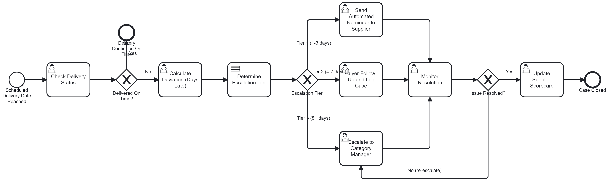

# Delivery-deviation-escalation-BPMN
A BPMN process model with an embedded DMN decision table, built to formalize
how late supplier deliveries are classified, escalated, and resolved.

## Problem

In supplier-heavy supply chains, late deliveries are often tracked manually —
spreadsheets, email threads, and ad-hoc follow-ups. This leads to inconsistent
escalation, missed response windows, and no structured record of supplier
reliability. This project models a standardized, rule-based process for
detecting, classifying, and escalating delivery deviations.

## Process Diagram

The process:
1. **Check Delivery Status** once the scheduled delivery date is reached
2. **Gateway: Delivered On Time?** — closes the case immediately if yes
3. **Calculate Deviation (Days Late)**
4. **Determine Escalation Tier** (Business Rule Task) — calls the DMN table below
5. **Route by tier** — automated reminder, buyer follow-up, or category
   manager escalation
6. **Monitor Resolution**, looping back for unresolved cases
7. **Update Supplier Scorecard** and close the case
## Tools

BPMN 2.0, DMN 1.3, Camunda Modeler
